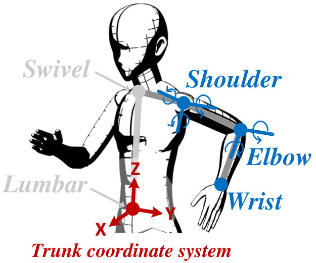

# ArmTroi

ArmTroi: Real-time Arm Skeleton Tracking using a Smartwatch. [paper link](https://www.cs.cityu.edu.hk/~zhenjili/2019-MobiSys-ArmTroi.pdf)

Authors: Yang Liu, Jiani Cao, Chengdong Lin, Zhenjiang Li, Zhidan Liu, Kaishun Wu

ArmTroi can achieve real-time 3D arm skeleton tracking using a smartwatch. The skeleton of each arm is determined from the locations of the elbow and wrist, whereas a smartwatch only senses a single point from the wrist. Result shows that the potential solution space is huge. This underconstrained nature fundamentally challenges the achievement of accurate and real-time arm skeleton tracking. In this study, we propose Hidden Markov Model (HMM) state reorganization, hierarchical search, likelihood-based pruning, and distance-based pruning to improve the heavyweight computation of the state-of-art arm tracking model [MobiSys'16] and achieve real-time tracking even on mobile phone.

**Demo video:**

[](https://www.youtube.com/watch?v=vmi3jffgvyE "ArmTroi Video")


## Citation:

If you find our work useful in your research, please consider citing:
```
@inproceedings{liu2019real,
title={Real-time arm skeleton tracking and gesture inference tolerant to missing wearable sensors},
author={Liu, Yang and Li, Zhenjiang and Liu, Zhidan and Wu, Kaishun},
booktitle={Proceedings of the 17th Annual International Conference on Mobile Systems, Applications, and Services},
pages={287--299},
year={2019}
}
```

## Modules and Sample data
This repository hosts the desktop-version implementation of ArmTroi, which can achieve real-time left arm skeleton tracking using a smartwatch worn on user's left wrist, and an example dataset. The code consists of three modules and has been tested using MATLAB R2018b. 

### Three Modules
The `src` folder contains three modules:
- `pointCloudGeneration`: generating personal point cloud for the user.
- `stateEstimation`: HMM-based skeleton tracking with HMM state reorganization, hierarchical search, likelihood-based pruning, and distance-based pruning.
- `kinectAlignmentForErrorCalculation`: calculating tracking errors based on the ground truth from Kinect.

### Example dataset
The example dataset in `data` folder is contributed by one subject with performing 14 different gestures one time, which contains following quantities:
- accData && orienData: motion data from the smartwatch (LG-W150) using Sensor.TYPE_LINEAR_ACCELERATION and Sensor.TYPE_GAME_ROTATION_VECTOR APIs from Google Android.
- kinectOrienData && kinectSkeletonData: ground truth from Kinect using GetJointOrientations and GetJoints APIs from Windows.
- Other user-specific parameters in the defined trunk coordinate system as shown in the following figure, including: la1 (half length of the shoulder length), la2 (length of the upper arm), la3 (length of the lower arm), ltrunk (length of the upper-body trunk), origin (location of the left shoulder in the trunck coordinate system), framelen and order (parameters using a Savitzky-Golay filter for filtering the ground truth from kinect).

<p align="center">
  
</p>

## Run ArmTroi

1. Load `data/example_dataset.mat`.
2. Run script `src/pointCloudGeneration/pointCloudGenerate_overall.m`.
3. Run script `src/stateEstimation/stateEstimation_overall.m`.
4. Run script `src/kinectAlignmentForErrorCalculation/kinectAlignmentForErrorCalculation_overall.m`.